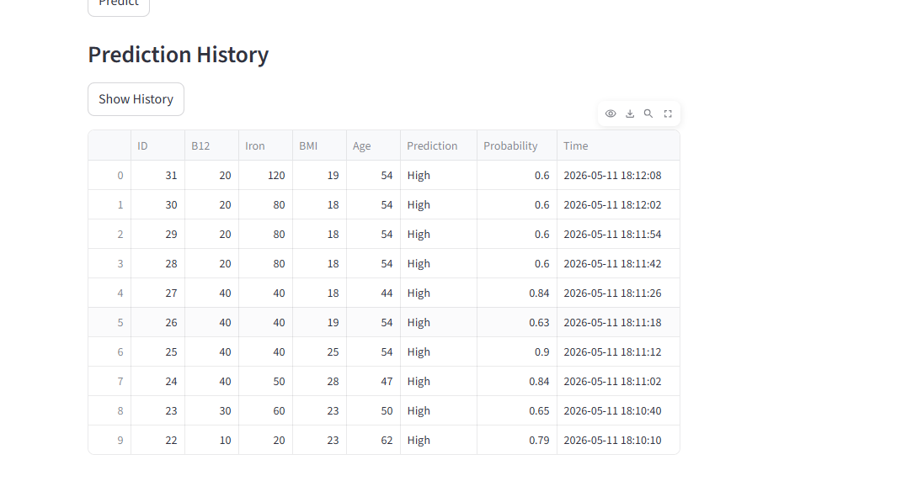
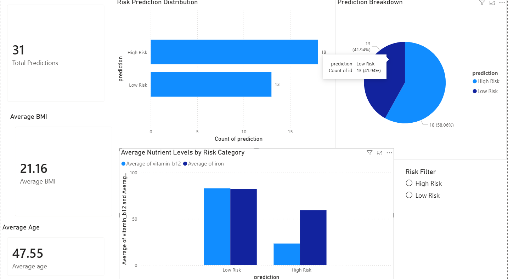
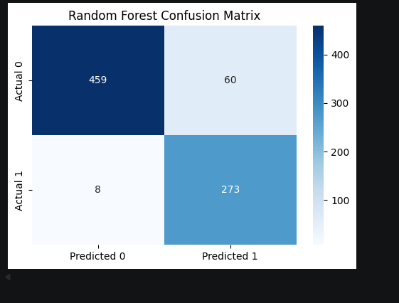
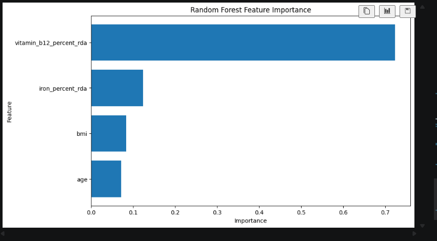
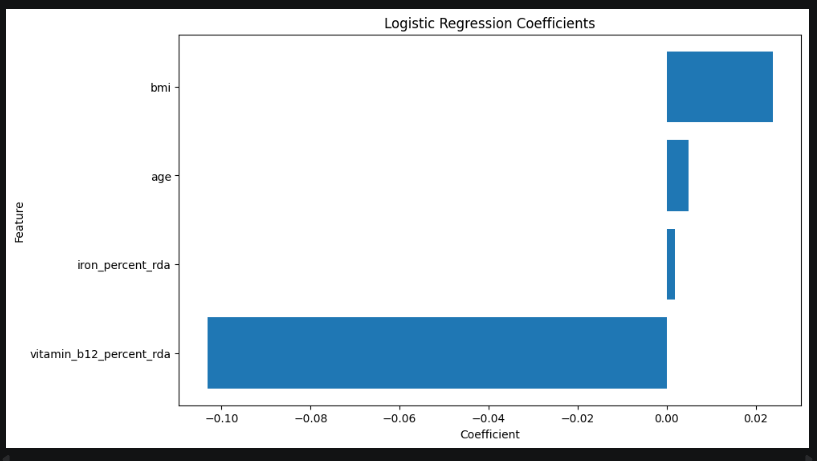

# Health Risk Predictor
## Overview
This project is a machine learning web application that predicts the likelihood of numbness based on key health indicators. Users enter their Vitamin B12 level, iron level, BMI, and age, and the app returns a prediction along with a probability score. The application is built with Streamlit and uses a trained Random Forest model. It also stores prediction results in a SQLite database so users can view recent prediction history.

## Features
- Predicts likelihood of numbness using machine learning
- Accepts user input for:
  - Vitamin B12 (% of RDA)
  - Iron (% of RDA)
  - BMI
  - Age
- Displays prediction result as high or low likelihood
- Shows prediction probability
- Saves predictions to a SQLite database
- Displays recent prediction history in the app
- Evaluates model performance using accuracy, precision, recall, F1-score, and confusion matrix
- Compares Random Forest performance with Logistic Regression
- Visualizes feature importance to show which health indicators influence predictions most
- Includes an interactive Power BI dashboard for analytics and risk visualization

## Technologies Used
- Python
- Streamlit
- pandas
- scikit-learn
- matplotlib
- seaborn
- joblib
- SQLite
- Power BI

## How It Works
1. The user enters health related values into the app.
2. The app organizes the user's input so the model can use it
3. A trained Random Forest model generates:
   - a prediction
   - a probability score
4. The result is shown in the interface.
5. The prediction is saved to a SQLite database with a timestamp.
6. The user can view the most recent saved predictions in the history section.

## Model Performance
Random Forest model performance:
- Accuracy: 91.5%
- Precision, Recall, and F1-score included through classification report
- Confusion matrix visualization added for performance evaluation

Model comparison:
- Logistic Regression Accuracy: 86.6%

Feature importance analysis showed Vitamin B12 as the strongest predictor, followed by iron, BMI, and age.

## Power BI Dashboard
A Power BI dashboard was created to analyze prediction outcomes and healthcare risk patterns interactively.

Dashboard features:
- Total predictions KPI
- Average BMI KPI
- Average Age KPI
- Risk prediction distribution bar chart
- Prediction breakdown pie chart
- Interactive risk filter slicer

This dashboard adds a business intelligence analytics layer to the machine learning project.

## Screenshots

### Streamlit Application

### Prediction History

### Power BI Dashboard

### Model Accuracy Comparison

### Random Forest Confusion Matrix

### Random Forest Feature Importance

### Logistic Regression Coefficients

## Project Files
- app.py — main Streamlit application
- rf_model.pkl — trained machine learning model
- model_features.pkl — saved model feature structure
- predictions.db — SQLite database storing prediction history
- README.md — project documentation

## How to Run
### 1. Install dependencies
pip install streamlit pandas scikit-learn joblib

### 2. Run the application
streamlit run app.py
### 3. Open in browser

## Example Use Case
This project can be used as a basic health risk screening tool that demonstrates how machine learning can support simple prediction tasks based on input health data.
This project can also be used as a portfolio demonstration of machine learning model evaluation, healthcare risk analytics, and business intelligence dashboard reporting.

## Future Improvements
- Add more health features to improve prediction quality
- Show clearer explanation of what influences the prediction
- Improve the user interface
- Deploy the application online
- Add charts for prediction trends over time

## Purpose
This project demonstrates practical skills in:
- machine learning
- data handling
- database integration
- interactive app development

This project demonstrates practical machine learning, data analysis, and application development skills used in real world scenarios
